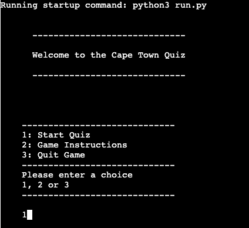
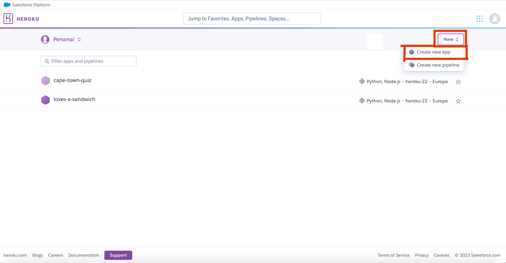
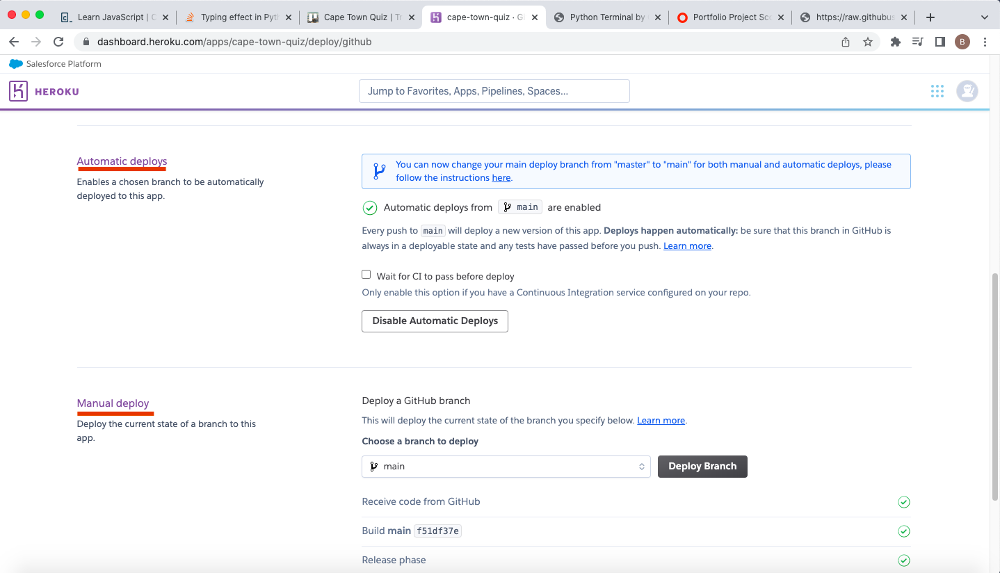

# Cape Town Quiz

The project is a python based terminal quiz game. The purpose of the quiz is to answer eight questions and get a score. 
The goal of the quiz is an educational and fun to do quiz on Cape Town. 

As a temporary resident of Cape Town, I wanted to share my enjoyment of the city this was my inspiration for the quiz.

Play the game here - https://cape-town-quiz.herokuapp.com/

# Table of Contents

- [Cape Town Quiz](#cape-town-quiz)
- [Table of Contents](#table-of-contents)
- [User Experiance UX](#user-experiance-ux)
  - [User-Stories](#user-stories)
    - [Primary Goal](#primary-goal)
    - [User Goals](#user-goals)
      - [First Time Player](#first-time-player)
      - [Returning Player](#returning-player)
  - [Design Process](#design-process)
    - [Planning Stage](#planning-stage)
    - [Data Model](#data-model)
    - [Project Management](#project-management)
- [Features](#features)
  - [Front Screen](#Front-screen)
  - [Game_Instructions](#game_instructions)
  - [Start Game](#new_game)
  - [Check Answer](#check_answer)
  - [Display Score](#display_score)
  - [Play Again](#play-again)
  - [Game Exit](#game_exit)
  - [Features Left to Implement](#features-left-to-implement)
- [Testing](#testing)
  - [Bugs Found and Fixed](#bugs-found-and-fixed)
  - [Unresolved Bugs](#unresolved-bugs)
  - [Technologies Used](#technologies-used)
  - [Python Packages](#python-packages)
- [Deployment](#deployment)
  - [Game Link](#game-link)
  - [Cloning of the project](#cloning-of-the-project)
  - [Credits](#credits)
    -[Content](#content)
- [Acknowledgements](#acknowledgements)

[Back to Top](#table-of-contents)

# User Experiance UX

## User-Stories

### Primary Goal

The primary goal of the project is to create a simple quiz to educate people about Cape Town. 

A quiz that can be played multiple times with questions picked at random on each playing. The questions have different difficulty level meaning they will be a challenge for 1st time players and return users.

### User Goals

#### First Time Player
  - User can read the title of the quiz.
  - User will immediately see the three game navigation options.
  - User can start quiz immediately.
    - User can see the question and the answer options quickly.
    - User gets immediate feedback if the answer is incorrect.
    - User is provided the correct answer if answer is incorrect.
    - User is provided total score automatically after quiz is finished.
    - User has option to play again.
  - User can navigate to the game instructions.
  - User can quit the game easily.
#### Returning Player
 - User has familiarity with game structure and start quiz with out instructions.
 - User will always have the questions asked at random. 

[Back to Top](#table-of-contents)

## Design Process
### Data Model

To visualise a process flow of the game is used [balsamiq](balsamiq.com). This helped with the project and time management to ensure that what i had visualised could be completed.

### Quiz Design

The design and feel of the quiz is intentionally minimalistic. The design choice was to make it feel like a quiz game from a CLI application with the only colour being in the emoticons added.

### Project Management

To organise my ideas, provide structure and the to-do task/ sub tasks that had to be worked on etc.
I used [Trello](https://trello.com/home) to log the completed tasks for stage.

In the intial project kick off - i created a high level to do task. Then split this into sub-tasks.

These tasks were then allocated down into the to-do, doing and done tasks. 

I found this tool very useful to visualise the tasks that had to be done. 

However a learning point i have taken for the project is to plan further to greater detail. For example, i feel i need to plan out the formulas to a low level of detail.

[Back to Top](#table-of-contents)

## Features
### Front screen

The first page the user sees when the page is loaded. The user is then invited to make a choice. Their input is validated to ensure either a new game, the instructions or game exit options are selected.

### Game Instruction

The game instructions are provided

### Start Game

Starts a new quiz game starts.

### Check Answer

With each guess made, the guesses are validated.
This is to ensure either A,B,C or D is chosen. 
With each correct guess, 1 point is added to the score. 

### Display Score

The total of the correct scores are added together and shown as a %.

### Play Again

The user is provided the option to play again.

### Game exit

The user is given the option to leave the quiz.

[Back to Top](#table-of-contents)

## Features Left to Implement
- Highscore - to allow the player to gain a log of their previous games. This would allow a username to be added.
- More questions - to increase the randomness of the questions/
- Multiple Topics 

## Testing

For testing the application, this is documented in a separate testing file [Testing](TESTING.MD)

[Back to Top](#table-of-contents)

Unresolved Bugs
to long code - error on linter

## Technologies Used.

- [Github](https://github.com). To Edit and Deploy thw website.
- [Gitpod](https://gitpod.io/projects) To deploy and create the website.
- [Heroku](https://www.heroku.com) - To deploy the game into a mock terminal that allow the game to be played online.
- [Python](https://www.python.org/) - To produce and run the app.
- [NodeJs](https://nodejs.org/en) To produce and run the app.
- [CI Python Linter](https://pep8ci.herokuapp.com/) - To find and validate errors in code.
- [Trello](https://trello.com/) - to manage project manage my ideas.
- [Stack Overflow](https://stackoverflow.com/) - to find dedug and find solutions to my questions. 
- [Real Python.com](https://realpython.com/) to find dedug and find solutions to my questions.
- [Facebook-emoticons](https://www.i2symbol.com/facebook-emoticons)
- [balsamiq](balsamiq.com) - used to create a process flow of my ideas

## Python Packages
- [Time](https://docs.python.org/3/library/time.html) - Used for the slow print functionality and for delaying print statements.
- [Random](https://docs.python.org/3/library/random.html) - Used within the slow print functionality.
- [OS](https://docs.python.org/3/library/os.html) - Used to clear the screen in the terminal.

### Deployment.
I deployed the game using Heroku, a cloud based container platform. This platform is specifically designed to deploy, manage and scale applications.

The below steps were followed.
1. Create an account on Heroku.
2. Ensure the Heroku student credits were successfully applied.
3. On Dashboard. Click New. Then create new app.

4. Navigate to Settings section.

5. Click Config Var.
6. Add Config Var.
- Key: PORT.
- Value: 800.
7. Click Buildpacks.
- add Buildpacks for python and nodejs. This is to link the app to these softwares.

8. Navigation Bar - Deploy.
9. Deployment Method - click Github

- add name of repository into search bar for Heroku to search for.
10. Deploys.
- Click Automatic or Manual Deploy 

[Back to Top](#table-of-contents)

### Game Link

[Back to Top](#table-of-contents)

### Cloning of the Project.

To create a local clone of the project, please follow the below steps.
- In the GitHub repository, under the repository name there is a code tab., click on the code
  - In the clone tab, click the HTTPS tab. Within this section, click on the clipboard icon and copy the URL supplied for the repository.
  - Open an IDE of your choosing and run Git Bash.
  - Change the current working directory to the location of which you wish to place the cloned repository.
  - In the terminal, write Git Clone and then paste in the URL supplied via GitHub from step 2.
  - Press enter and your new cloned repository will be created within the desired location.
  
[Back to Top](#table-of-contents)

## Credits
 
### Content
- The idea for the structure of the quiz was taken from two Bro Code youtube videos on building a python based quiz game. 
  - https://www.youtube.com/watch?v=yriw5Zh406s. The inital code for functions new_game(), check_answer(), display_score() and replay_game() was taken from here.
- Quiz functionality BroCode youtube Video. https://www.youtube.com/watch?v=zehwgTB0vV8&t=188s.
Used as guide on how to build a python quiz.
- Code institue Love Sandwiches Project. Was used for help and gudiance in the input validation functions.
- Real Python. For guidance on the sorting of the questions https://realpython.com/python-quiz-application/#step-2-make-your-application-user-friendly.
- Stack Overflow.
  - logic on how to quit a quiz. For the quit game funciton. https://stackoverflow.com/questions/58913904/how-to-quit-on-a-python-quiz
  - How to generate random questions for a quiz game. https://stackoverflow.com/questions/71743506/how-to-generate-random-questions-and-corresponding-answers-for-quiz-game

### Acknowledgements

With my 3rd portfolio Project, i would like to thank my mentor Precious, for his feedback, guidance and patience to help map and improve my idea in the project. 
I would also like to thank the tutor support team with their help to debug my ideas into solutions.
