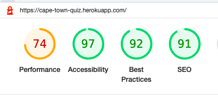

# Testing

## Code Validation

The testing of [Cape Town Quiz](https://cape-town-quiz.herokuapp.com/) was done through [CI Python Linter](https://pep8ci.herokuapp.com/).
With each line of code, function writen and feature defined. The code was checked in the linter to solve the errors flagged. 
In addition frequent print statements were completed to ensure that the code worked and bugs found were solved. 

The Bugs found and how they were fixed are defined in the below section.

## Browser Compatibility 

Quiz tested on: 

|Browser.      | Outcome   |
----------------------------
|Google Chrome | No Errors |
|Safari        | No Errors |
|Edge          | No Errors |
|Firefox       | No Errors |

## Responsiveness Testing. 

Testing was completed on Am I responsive to show the quiz successfully responds to different screen sizes.

Iphone SE |	Iphone XR |	Samsung Galaxy |Surface	Ipad |Laptop |1200px
---------------------------------------------------------------------	
Render    |	Yes       |	Yes	           |Yes	         |Yes	 |Yes	

## Bugs Found and fixed

| Bug | Where | Fixed How|
--------------------------
Error- Code to long | line 105 | Changed the naming of the lists being randomised. Logic taken from https://stackoverflow.com/questions/53158284/python-giving-a-e501-line-too-long-error
Final score % being calculated from un randomised list | line 182 | Fixed updating the list the correct answer is taken from.
Input validation - If incorrect selection is made (Not A,B,C,D) - user still able to go on to next question | line 142 | Fixed by create separate function for the validation. Logic taken from Code Insitiute love sandwiches project. 
Trailing WhiteSpace | Various points in the validation - error shown | Fixed by checking stackoverflow and reapplying the recommendation to the code. https://stackoverflow.com/questions/21410075/what-is-trailing-whitespace-and-how-can-i-handle-this
"Missing Docstrings warning" Pylint | Run.py doc | Stack Overflow https://stackoverflow.com/questions/7877522/how-do-i-disable-missing-docstring-warnings-at-a-file-level-in-pylint 

[Unfixed Bugs](unfixed-bugs)

There are no known unfixed bugs.

## Input Validation

Each screen where the user inputs data has been tested. 

1. User makes a choice of whether to start the quiz, look at instructions or Quit Game.
- Possible validation errors:
    - User could input not 1,2 or 3
- Validation
    - if not 1,2,3 - the user advised its an invalid selection and is directed back to the choice. 

2. Question Answer.
- Possible validation error:
    - user could input not A,B,C or D
    - user could enter a number.
- Validation. 
    - if not A,B,C or D the user advised its an invalid selection and is directed back to the choice. 

3. Replay game.
- The user is asked "How about another game? - YES OR NO?" 
- Possible validation error
    - They could answer not YES or NO.
- Validation
    - if not YES or NO the user advised its an invalid selection and is directed back to the choice. 

 ## Additional Testing

 As additional testing through Dev Tools a [Google Lighthouse](https://developers.google.com/web/tools/lighthouse) report has been run. 

 The below aspects were tested. 
 - Performance - reveals how the site performs during loading
- Accessibility - shows if the site if accessible for all users and suggests ways to improve it
- Best Practices - indicates if the site conforms to industry best practices
- SEO - Search Engine Optimisation - shows if the site is optimised for search engine result rankings

### Results from Lighthouse

